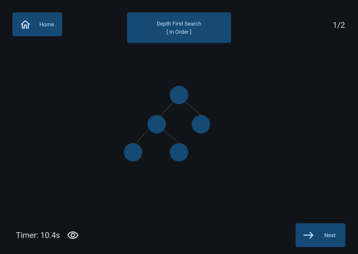

# Noderace
> A website for students to learn traversal algorithms by competing in races to label nodes in traversal order.

[Prototype](https://www.figma.com/proto/4v0wFz6PQfsuwVF86UXHVd/Prototype?node-id=0-1&t=AN4M2ihLW1B0FmG8-1)

Built between a group of six:
- Ming Bao
- Alexander Heffernan
- Cara Lill
- Galen Green
- Jacob Lum
- Alan McIlwaine
