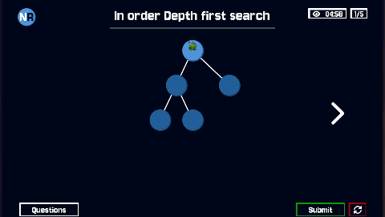

<a id="readme-top"></a>


<!-- PROJECT LOGO -->
<br />
<div align="center">
  <a href="https://github.com/Team-GitGud/node-race">
    
  </a>

  <h3 align="center">NodeRace</h3>

  <p align="center">
    A website to reinforce traversal algorithms with your friends.
    <br />
    <a href="https://www.youtube.com/watch?v=c90IWaukNnI">View Demo</a>
    &middot;
    <a href="https://noderace.online">View Website</a>
  </p>
</div>
</br>

<div align=center>
  
  [![Contributors][contributors-shield]][contributors-url] [![Issues][issues-shield]][issues-url] [![Unlicense License][license-shield]][license-url]
  
</div>

<!-- ABOUT THE PROJECT -->
<div align="center">
   
</div>

</br>
</br>

## About The Project  

**NodeRace** is a multiplayer web game that makes learning **DFS** and **BFS** fun and competitive.  

- Race against peers to solve tree traversal challenges under time pressure  
- Features real-time lobbies, global leaderboards, and a sleek dark-themed UI  
- Next steps: tutorials, single-player mode, and accessibility improvements  

<p align="right">(<a href="#readme-top">back to top</a>)</p>


### Built With  

[![Vue][Vue.js]][Vue-url]
[![TypeScript][TypeScript.js]][TypeScript-url]
[![Node.js][Node.js]][Node-url]
[![Express.js][Express.js]][Express-url]
<p align="right">(<a href="#readme-top">back to top</a>)</p>


<!-- GETTING STARTED -->
## Getting Started
### Prerequisites
Install npm
* MacOS
  ```sh
  brew install node
  ```
* Linux (Debian/Ubuntu)
  ```sh
  sudo apt update
  sudo apt install nodejs npm -y
  ```
* Windows
  ```sh
  winget install OpenJS.NodeJS.LTS
  ```

### Usage
1. Run ```npm install``` inside both /frontend and /backend
2. Start the backend server:
```sh
cd backend
npm run dev
```
3. Start the frontend:
```sh
cd frontend
npm run serve
```

<p align="right">(<a href="#readme-top">back to top</a>)</p>

### Contributors:

<a href="https://github.com/othneildrew/Best-README-Template/graphs/contributors">
  
</a>

<p align="right">(<a href="#readme-top">back to top</a>)</p>


<!-- LICENSE -->
## License

Distributed under the GNU AGPLv3 License. See `LICENSE` for more information.

<p align="right">(<a href="#readme-top">back to top</a>)</p>


<!-- ACKNOWLEDGMENTS -->
## Acknowledgments

* [Choose an Open Source License](https://choosealicense.com)
* [Img Shields](https://shields.io)
* [Font Awesome](https://fontawesome.com)
* [Template](https://github.com/othneildrew/Best-README-Template)

<p align="right">(<a href="#readme-top">back to top</a>)</p>


<!-- MARKDOWN LINKS & IMAGES -->
[contributors-shield]: https://img.shields.io/badge/Contributers-6-blue
[contributors-url]: https://github.com/Team-GitGud/node-race/graphs/contributors
[issues-shield]: https://img.shields.io/github/issues/Team-GitGud/node-race
[issues-url]: https://github.com/Team-GitGud/node-race/issues
[license-shield]: https://img.shields.io/badge/License-GNU%20AGPLv3-blue
[license-url]: https://github.com/Team-GitGud/node-race/blob/main/LICENSE

[Vue.js]: https://img.shields.io/badge/Vue.js-35495E?style=for-the-badge&logo=vuedotjs&logoColor=4FC08D
[Vue-url]: https://vuejs.org/

[Node.js]: https://img.shields.io/badge/Node.js-43853D?style=for-the-badge&logo=nodedotjs&logoColor=white
[Node-url]: https://nodejs.org/

[Express.js]: https://img.shields.io/badge/Express.js-000000?style=for-the-badge&logo=express&logoColor=white
[Express-url]: https://expressjs.com/

[TypeScript.js]: https://img.shields.io/badge/TypeScript-007ACC?style=for-the-badge&logo=typescript&logoColor=white
[TypeScript-url]: https://www.typescriptlang.org/
[product-screenshot]: docs/images/question-answering.gif
